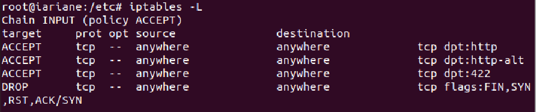
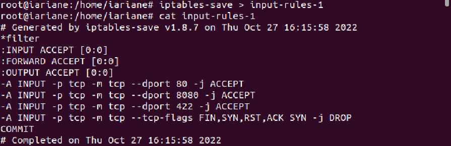
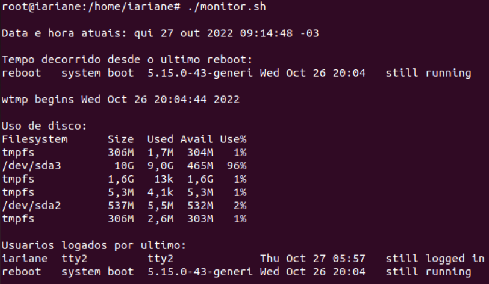
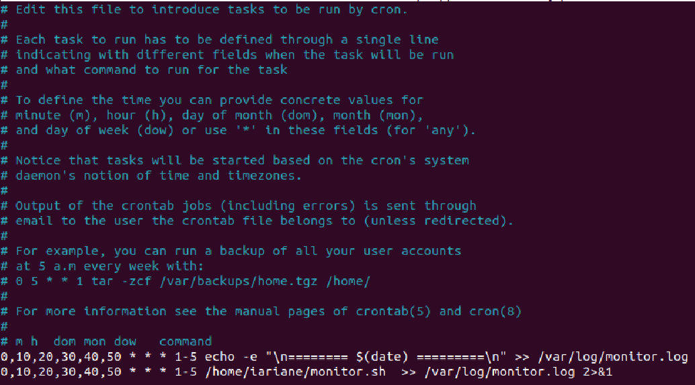
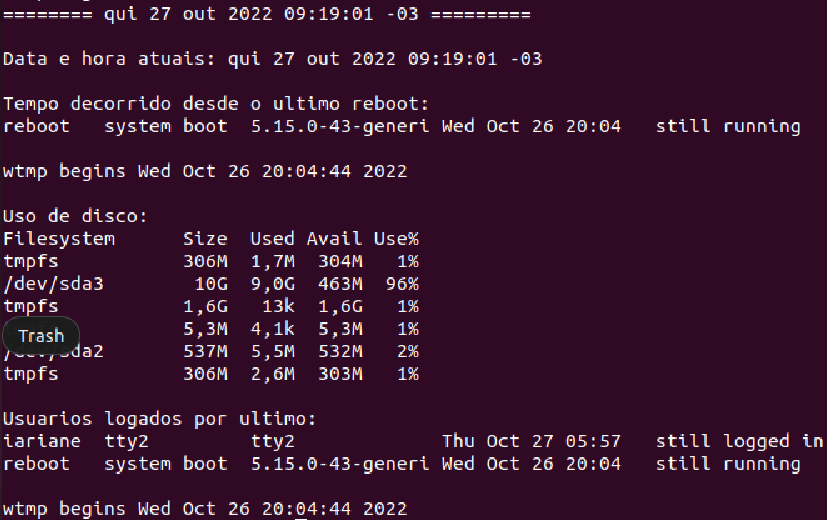

<p><b>01.</b> Criar uma máquina virtual linux ubuntu 22.04 LTS no VirtualBox.</p>

[🔗 Criando uma Máquina Linux no VirtualBox](https://www.youtube.com/watch?v=7FCYFy0J4NQ) | [🔗 UBUNTU 22.04.1 LTS](https://ubuntu.com/download/desktop)
<p><b>02.</b> O usuário root deve vir configurado com a senha "unip".</p>
<p><b>03.</b> Cadastrar como usuários desta máquina virtual cada um dos integrantes do grupo, onde o usuário é definido como a primeira letra do nome concatenada ao sobrenome. Exemplo: João da Silva --> jsilva.</p>
<p><b>04.</b> A senha de cada usuário deve ser o código correspondente ao seu RA na UNIP.</p>
<p><b>05.</b> Configure os parâmetros de rede para que a máquina tenha acesso a internet.</p>
<p><b>06.</b> Instalar o serviço de firewall de modo que ele suba na inicialização do SO e configure o mesmo para <b><i>bloquear todas a portas</i></b> menos as 80, 8080 e 422.</p>

[🔗 Como utilizar o Iptables (Netfilter)](https://terminalroot.com.br/2014/11/como-utilizar-o-iptables-netfilter.html)

```bash
iptables -A INPUT -p tcp --destination-port 80 -j ACCEPT
iptables -A INPUT -p tcp --destination-port 8080 -j ACCEPT
iptables -A INPUT -p tcp --destination-port 422 -j ACCEPT
iptables -A INPUT -p tcp --syn -j DROP

# para ver se funcionou
iptables -L
```



<p> Agora temos que salvar tudo isso para quando der o reboot continuar lá bonitinho pra gente: </p>

```bash
# salve as regras no arquivo input-rules-1 cujo nome pode ser o que você quiser
iptables-save > input-rules-1

# visualizar as regras salvas, mas se formos reinicializar o sistema, essas regras serão perdidas e teremos que restaurar do arquivo input-rules-1. Para tornar essas regras permanentes, temos que salvá-las no arquivo '/etc/sysconfig/iptables'. Primeiro verifique se este arquivo contém algumas regras ou não.
cat input-rules-1

# salve o arquivo de regras '/etc/sysconfig/iptables'. Pesquise o arquivo com o comando 'grep' - dessa forma podemos observar que as regras foram salvas neste arquivo
service iptables save
```



<p> 💩 deu erro `iptables: unrecognized service` </p>

```bash
sudo /sbin/iptables-save

```

<p> 💩 a pasta 'sysconfig' não existe </p>

```py
# aplique o TGU - Teorema da Gambiarra Universitária - e crie as pastas necessárias pelo comando mkdir
```

[🔗 Salvar configuração](https://www.youtube.com/watch?v=eKbm7A0Ur7k) | [🔗 Unrecognized Service Error](https://www.altaruru.com/iptables-unrecognized-service/)

<p><b>07.</b> Criar um script (/home/root/monitor.sh) que colete informações do sistema como: hora atual da coleta dos dados; tempo decorrido desde o último reboot; ocupação do disco e suas partições; memória total e ocupada; usuários logados sistema.</p>

```bash
# Linux Terminal ./home/username
touch monitor.sh
nano monitor.sh
```
------------
```shell
# Arquivo Shell Script ./home/username
# !/bin/bash
now=$(date)
echo -e "\nData e Hora atuais: $now\n"
last_reboot=$(last reboot)
echo -e "Tempo decorrido desde o último reboot: \n$(las_reboot)\n"
disk_usage=$(df -H --output=source,size,used,avail,pcent)
echo -e "Uso de Disco: \n$disk_usage\n"
user_login=$(who)
echo -e "Usuários que estão logados:\n$user_login\n"
```

<p> E o output fica assim: </p>



<p><b>08.</b>  Faça o agendamento deste script usando o serviço cron/crontab para que a partir do boot do sistema, ele <b>colete estas informações periodicamente a cada 10 minutos, somente nos dias uteis de trabalho (segunda a sexta-feira)</b>.</p>


```bash
0,10,20,30,40,50 * * * 1-5
```

---
[🔗 Editor de Expressão Crontab](https://crontab.guru/#0,10,20,30,40,50_*_*_*_1-5) | [🔗 Texto sobre Agendamento Linux](https://www.digitalocean.com/community/tutorials/how-to-use-cron-to-automate-tasks-ubuntu-1804-pt)

As informações atuais coletadas, devem ser concatenadas às coletadas em iterações anteriores.

```bash
bash [script_a_ser_executado] >> [script_que_contém_registros]
```

---
[🔗 Linux Append Text | Concatenamento de Texto Linux](https://www.cyberciti.biz/faq/linux-append-text-to-end-of-file/)

Estas informações devem ser persistidas no arquivo /var/log/monitor.log.

```bash
# linux terminal 
cd /
cd var
cd log
touch monitor.log
crontab -e
```
---
```bash
# aarquivo editável do crontab
0,10,20,30,40,50 * * * 1-5 /home/username/monitor.sh >> /var/log/monitor.log
```

<p> Arquivo Crontab </p>



<p> Output da rotina criada </p>

```bash
cat /var/log/monitor.log
```



[🔗 Como encontrar o "caminho" de arquivos](https://www.tecmint.com/35-practical-examples-of-linux-find-command/) | [🔗 EasyCron](https://www.easycron.com/user) | [🔗 Como usar o Crontab](https://www.youtube.com/watch?v=Qf5SPjHzvyw)

<p><b>09.</b> Instalar o serviço de proxy usando o squid e crie regras de bloqueio dos sites de redes sociais como: facebook; youtube; instagram.</p>

```bash
# instalando o squid, faça estando no root /home/username
sudo apt-get update
sudo apt-get upgrade
sudo apt install squid

# para verificar se deu tudo certo
sudo systemctl status squid

# só dar CTRL+C para sair
```

---
```bash
agora vamos configurar o squid
cd /etc/squid
sudo cp squid.conf squid.conf_old
sudo nano squid.conf
```

<h3>★ Alternativa I </h3>

```bash
# ai você encontra a parte do 'INCLUDE' no arquivo e logo abaixo escreve
acl block dstdomain "https://net.cloudinfrastructureservices.co.uk/etc/squid/website_block.txt"
http_access deny block
```

---
```bash
# vamos criar o arquivo website_block.txt
nano /etc/squid/website_block.txt

# vamos definir os websites que devem ser bloqueados
.facebook.com
.twitter.com
.lyoutube.com
.instagram.com
```

---
```bash
# dar restart para aplicar as modificações
systemctl restart squid
```

---
<h3>★ Alternativa II </h3>

```bash
# squid.conf
acl rede_interna src [seu ip]

acl sites_bloqueados url_regex -i "/etc/squid/sites_bloqueados"
acl palavras_bloqueadas url_regex -i "/etc/squid/palavras_bloqueadas"

http_access deny sites_bloqueados
http_access deny palavras_bloqueadas

http_access allow rede_interna
http_access deny all
```

<p> Configure o arquivo com os sites a serem bloqueados </p>

```bash
# sites_bloqueados
www.facebook.com
facebook.com

www.instagram.com
instagram.com

www.youtube.com
youtube.com
```

<p> Configure o arquivo com as palavras a serem bloqueadas </p>

```bash
# palavras_bloqueadas
facebook
instagram
youtube
```

<p> Dê restart no srvio exatamente para ele salvar e aplicar as configurações </p>

```bash
# linux terminal /etc/squid
sudo systemctl restart squid.service
```

---
<h3> Prevenindo o Reboot do SO </h3>

<h4>✦ Alternativa I </h4>
<p> Vamos fazer manualmente aqui: </p>

```bash
/etc/sysctl.conf

# escreva isso aqui no rquivo
net.ipv4.ip_forward = 1
sysctl -p /etc/sysctl.conf

# volta pro terminal e acessa esse arquivo aqui
/etc/rc.local

# escreve isso aqui no arquivo
echo 1 > /proc/sys/net/ipv4/ip_forward

```

<h4>✦ Alternativa II </h4>
<p> Aqui vamos instalar uma libzinha/package-do-bem: </p>

```bash
sudo apt install molly-guard
```

[🔗 Lib/package-do-bem do Reboot](https://www.2daygeek.com/how-to-avoid-or-prevent-accidental-shutdown-or-reboot-on-linux/)
